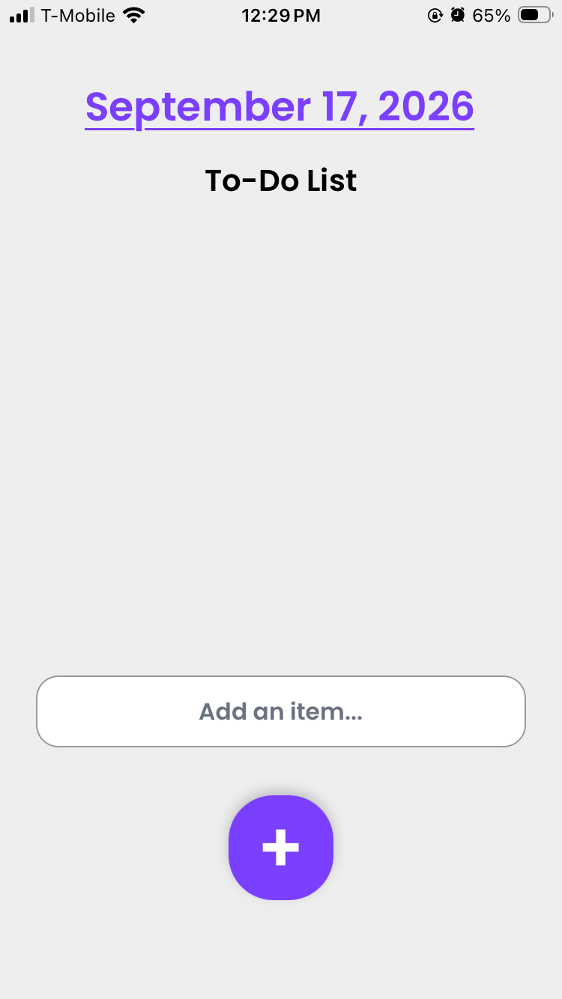
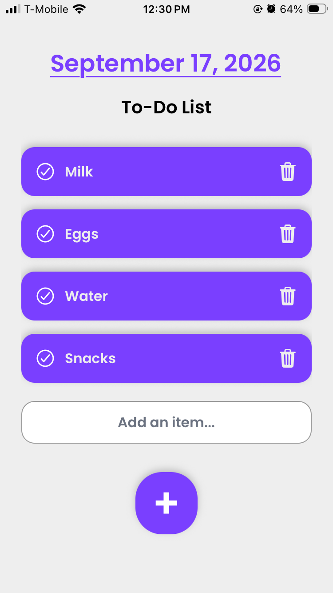
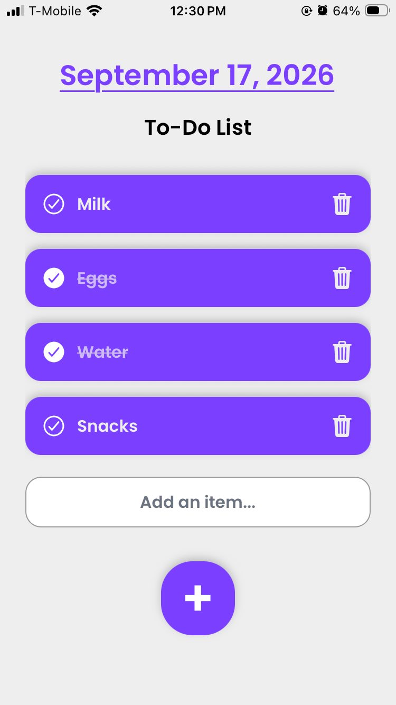
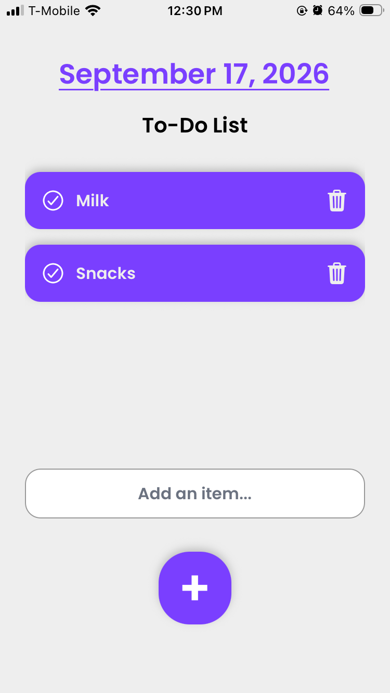

# Mario Todo List

## Screenshots

<div align="center">
  <table>
    <tr>
      <td width="25%"></td>
      <td width="25%"></td>
      <td width="25%"></td>
      <td width="25%"></td>
    </tr>
  </table>
</div>

A simple Expo + React Native to-do list app built with Expo Router. This project shows a daily date header, a list of tasks, add-item input, and a completion toggle with a strike-through effect.

## Project info

- Expo SDK: 57
- React Native: 0.86
- App type: Expo managed app
- Main file: `src/app/index.tsx`

## Features

- Checkmark button to mark a task as complete
- Trash button to delete tasks
- Add item input for creating new todos
- Date display at the top of the screen
- Strike-through effect for completed tasks
- Clean purple mobile-friendly layout

---

## Prerequisites

Before running the app, make sure you have:

- Node.js LTS installed
- npm installed with Node
- Android Studio or Xcode if you want to run on an emulator/simulator
- Expo Go installed on a physical phone if you want to scan the QR code

Check versions:

```bash
node -v
npm -v
```

---

## Step-by-step: run the Expo app

### 1. Open the project folder

Open a terminal in the project root folder:


If you are already inside the folder, skip this step.

### 2. Install dependencies

Run:

```bash
npm install
```

This installs all project dependencies from `package.json`.

### 3. Start the Expo development server

Run:

```bash
npx expo start
```

This starts the Metro bundler and prints a QR code and terminal options.

### 4. Open the app

Choose one of these options:

#### Option A: run on Android emulator

In the terminal, press:

```bash
a
```

This opens the app in an Android emulator if you have one set up.

#### Option B: run on iOS simulator

If you are on macOS with Xcode installed, press:

```bash
i
```

#### Option C: run on a physical phone

Install Expo Go from the App Store or Google Play, then scan the QR code shown in the terminal.

#### Option D: open in web browser

Press:

```bash
w
```

---

## Useful commands

```bash
npm install
npx expo start
npx expo start --clear
npm run android
npm run ios
npm run web
```

---

## If something does not work

### Dependencies are missing

```bash
npm install
```

### Metro cache is stuck

```bash
npx expo start --clear
```

### Expo is not recognized

Try:

```bash
npx expo --version
```

If that fails, reinstall dependencies and make sure Node is installed correctly.

### QR code does not open on mobile

Make sure:

- your phone and computer are on the same Wi-Fi network
- Expo Go is installed
- the app server is still running

---

## Project structure

```text
Mario_Todo-List/
├── app.json
├── package.json
├── src/
│   └── app/
│       ├── _layout.tsx
│       └── index.tsx
├── assets/
├── scripts/
├── tsconfig.json
└── README.md
```

---

## Notes

This app is a basic to-do list with a date header and a checkmark toggle to complete tasks. The main screen is in [src/app/index.tsx](src/app/index.tsx).

---

## Learn more

- [Expo docs](https://docs.expo.dev/)
- [Expo SDK v57 reference](https://docs.expo.dev/versions/v57.0.0/)
- [Expo Router docs](https://docs.expo.dev/router/introduction)
